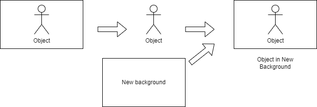
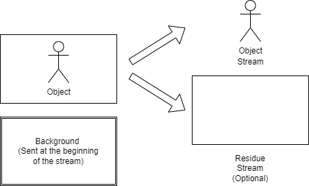
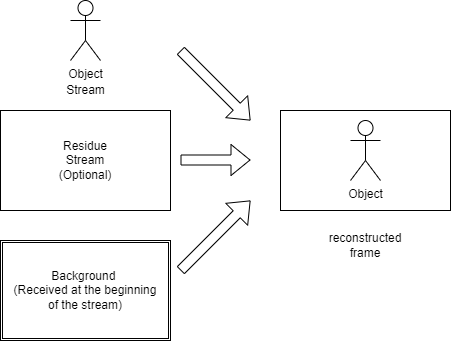
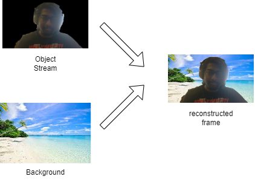

# Image-BG-Replacement

Code Files multiple algorithms for Image Background Replacement implemented for the completion of CSE 610 - Advanced Multiimedia Systems at University at Buffalo for Spring 2022 by Dr. Junsong Yuan. 

# Problem Description

Given below is an illustration for workflow for the solution:

Implemented 3 algorithms:
1. Otsu's thresholding
2. Grabcut with Otsu's Thresholding Mask initialization
3. K-Means segmentation
4. Grabcut with DeepLabv3 Segmentation as Mask initialization

## Results

## MPEG-4 obect based coding realization through foreground extraction

Based on the results above, I proposed a way to realize MPEG-4 obect based coding

### Sender

### Receiver

### Example

